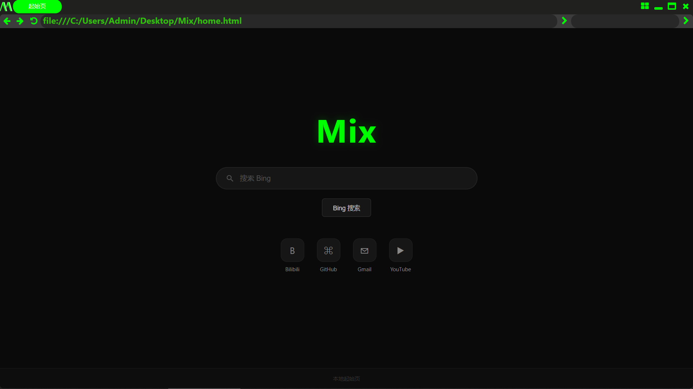

# Mix By Webview2

  

 <strong>一款极致轻量的浏览器</strong> 

  

## ✨ 简介
- 基于 Chromium (WebView2) 内核的 Windows 浏览器。追求极致的轻量与简洁，本体仅2.54M，致力于提供干净、高效的浏览体验。

## 🖼️ 截图

  

## 🚀 功能特性

### 🗂️ 多标签
- 就算把体积压缩到了极致，仍然实现了多标签页的功能
- 每个标签页独立运行，自动同步网页标题到标签栏

### 🧩 Chrome 扩展支持
- 支持加载本地 Chrome 扩展程序（放置于 crx 目录）
- 支持扩展内容脚本注入

### 📜 用户脚本注入
- 支持自定义 JavaScript 脚本自动注入
- 将 .js 脚本文件放入 scripts 目录，每次页面加载完成后自动执行

### ⌨️ 窗口布局快捷键
- 内置窗口布局管理：
- 点按布局键

> [!TIP]
> |快捷键|功能|
> |---|---|
> |← →|窗口左右分屏 / 移动|
> |↑ ↓|窗口上下分屏 / 移动|
> |Space|重置窗口位置与大小|
> |Esc|退出布局模式|

### 🔧 浏览操作
- 地址栏导航：输入 URL 后按 Enter 或点击前往按钮
- 搜索栏：输入关键词后按 Shift + Enter 或点击搜索按钮，使用 Bing 搜索
- 快速编辑地址栏：Ctrl + ~ 快速聚焦地址栏并填充 https://

### 📌 系统托盘
- 最小化后自动收入系统托盘

## 📦 安装与使用

### 系统要求
- 操作系统：Windows 10 / 11
- 运行时：Microsoft Edge WebView2 Runtime（Windows 10/11 已预装）

### 快速开始

1. 从 Releases 页面下载最新版本
2. 解压到任意目录
3. 运行 Mix.exe

### 目录结构

- Mix/
- ├── Mix.exe    # 主程序
- ├── home.html    # 起始页
- ├── crx/    # 扩展目录
- ├── scripts/    # 脚本目录
- └── UserData/    # 用户数据

### 加载 Chrome 扩展

- 获取 Chrome 扩展的解压包（.crx 解压或从开发者模式导出）
- 将扩展文件夹放入 crx 目录
- 重启 Mix ，扩展将自动加载

### 添加用户脚本

- 获取 JavaScript 脚本文件（.js），放入 scripts 目录
- 脚本将在每个页面加载完成后自动执行

## 🛠️ 技术特点

- 基于 Chromium WebView2 引擎，兼容现代 Web 标准
- 原生 Windows 窗口程序，启动迅速，资源占用低
- 多标签页共享浏览器环境与用户数据，内存效率高
- 支持窗口圆角、阴影、淡入淡出等视觉效果
- 完善的窗口管理：最大化、最小化、托盘、多显示器适配

## 🗺️之后的版本

- [ ] 书签管理
- [ ] 浏览历史记录
- [ ] 下载管理器
- [ ] 标签页拖拽排序
- [ ] 自定义搜索引擎
- [ ] 主题切换（浅色 / 深色）
- [ ] 隐私浏览模式
- [ ] 多语言支持

ps:内置扩展BewlyCat,BilibiliSponsorBlock,Bili-qml，脚本Nya.user.js

---

 Made with 💚 by Mix Team 

